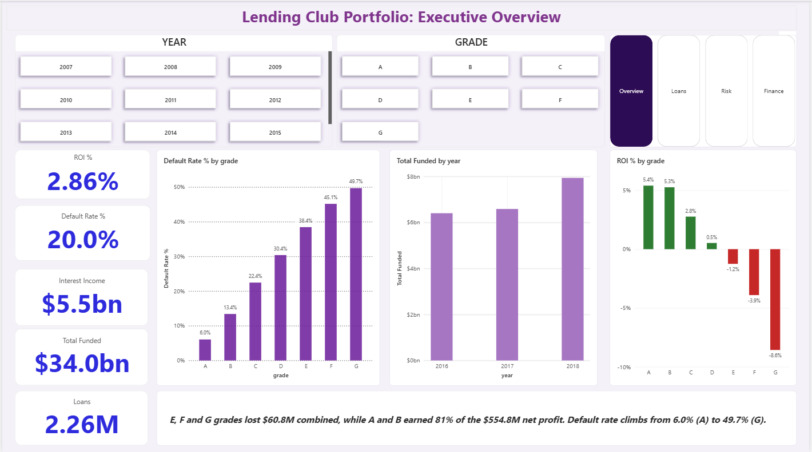
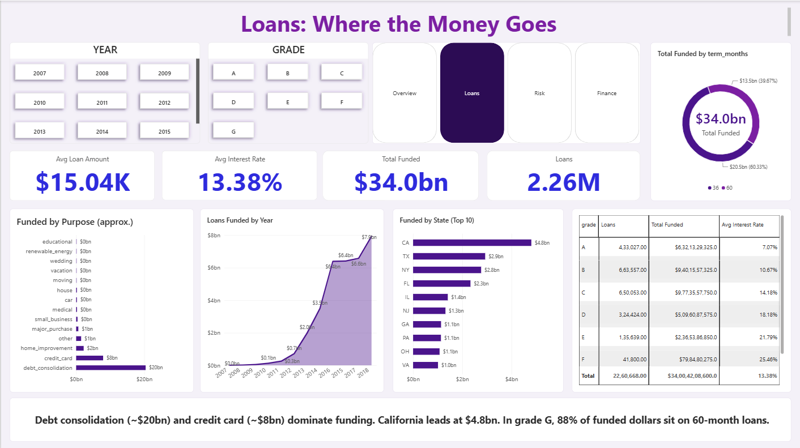
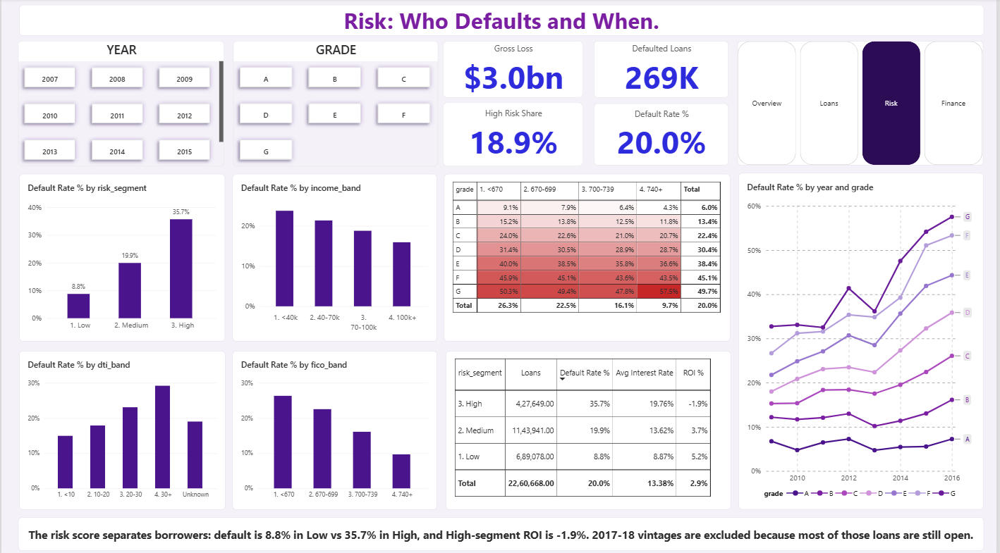
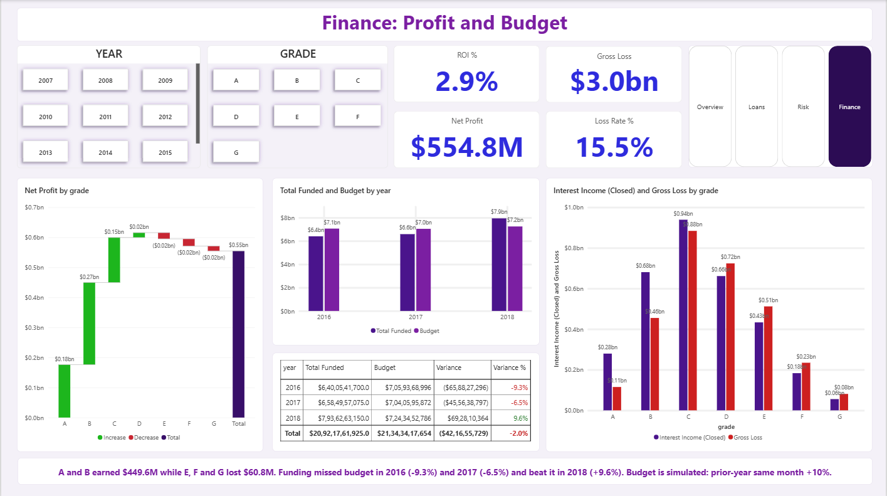

# Lending Club Portfolio Analytics

### Which borrowers default, and which loan grades actually make or lose money?

    

An end-to-end business and data analytics project on **2.26 million Lending Club loans (2007-2018)**: data engineering in DuckDB, a star schema, a rule-based risk score, budget variance analysis and a **4-page Power BI dashboard** with 20+ DAX measures.



---

## Table of Contents
1. [Problem Statement](#1-problem-statement)
2. [Why I Chose This Problem](#2-why-i-chose-this-problem)
3. [What I Am Solving](#3-what-i-am-solving)
4. [Dataset](#4-dataset)
5. [Solution Architecture](#5-solution-architecture)
6. [Dashboard Walkthrough (Page by Page)](#6-dashboard-walkthrough-page-by-page)
7. [Tech Stack and Why](#7-tech-stack-and-why)
8. [Important DAX Measures](#8-important-dax-measures)
9. [Challenges Faced and How I Solved Them](#9-challenges-faced-and-how-i-solved-them)
10. [Key Insights](#10-key-insights)
11. [How This Helps the Organization Grow](#11-how-this-helps-the-organization-grow)
12. [Limitations and Future Work](#12-limitations-and-future-work)
13. [Repository Structure and How to Run](#13-repository-structure-and-how-to-run)

---

## 1. Problem Statement

A lending business earns money from interest, but loses money when borrowers stop paying. Leadership usually sees these numbers in separate reports, so three questions stay unanswered:

- **Who defaults?** Which borrower profiles (grade, income, credit score, debt load) carry the most risk?
- **Where do we really make money?** A high interest rate looks attractive, but after defaults and unrecovered principal, is a loan grade still profitable?
- **Are we on target?** Is funding growing in line with the plan, and where did it miss?

This project builds one connected view of the loan portfolio that answers these questions with numbers a business team can act on.

## 2. Why I Chose This Problem

- **Lending is a high-stakes decision problem.** A single wrong approval policy can cost millions, so analysis here has a clear business value.
- **It covers many analyst roles in one project.** It needs data cleaning and modelling (data engineering), KPI design and dashboards (data and business analytics), profit and budget variance (financial analysis) and risk segmentation (data science thinking).
- **The data is real and messy.** It has 151 columns, mixed text and numeric fields, loans that are still running, and unusual status labels. Solving these is closer to real analyst work than a clean tutorial dataset.
- **The story is easy to explain.** "Higher interest does not mean higher profit" is a finding that a non-technical manager understands in one sentence.

## 3. What I Am Solving

| Business question | How the project answers it |
|---|---|
| How big is the portfolio and how is it distributed? | Funding by purpose, state, year and term (Loans page) |
| Who defaults? | Default rate by grade, income, DTI, FICO and a custom risk score (Risk page) |
| Which grades are profitable? | Net profit and ROI by grade, with loss isolated (Finance and Overview pages) |
| Are we meeting funding targets? | Actual vs budget with variance by year (Finance page) |
| Which year's lending was weakest? | Vintage analysis by issue year and grade (Risk page) |

## 4. Dataset

**Source:** Lending Club accepted loans, 2007 to 2018 Q4 (Kaggle).
**Size:** 2,260,701 raw rows and 151 columns (about 1.6 GB CSV). After cleaning: **2,260,668 loans**. Each row is one loan with borrower details, loan terms, credit history and payment outcomes.

**Column groups in the raw file**

| Group | Examples | Used? |
|---|---|---|
| Loan terms | `loan_amnt`, `funded_amnt`, `term`, `int_rate`, `installment`, `grade`, `sub_grade`, `purpose`, `issue_d` | Yes |
| Outcome | `loan_status` | Yes |
| Borrower | `annual_inc`, `dti`, `emp_length`, `home_ownership`, `verification_status`, `addr_state` | Yes |
| Credit score | `fico_range_low`, `fico_range_high` | Yes |
| Payments | `total_pymnt`, `total_rec_prncp`, `total_rec_int`, `total_rec_late_fee`, `recoveries`, `out_prncp` | Yes |
| Credit history, joint applications, hardship, settlement | about 120 other columns | No (mostly sparse or outside the questions) |

I kept **24 columns** that map directly to the business questions.

**Loan status distribution (raw)**

| Status | Loans |
|---|---|
| Fully Paid | 1,076,751 |
| Current | 878,317 |
| Charged Off | 268,559 |
| Late (31-120 days) | 21,467 |
| In Grace Period | 8,436 |
| Late (16-30 days) | 4,349 |
| Does not meet the credit policy (Fully Paid / Charged Off) | 1,988 / 761 |
| Default | 40 |

**Key definitions used throughout the project**

- **Closed loan:** Fully Paid, Charged Off or Default (including the "credit policy" variants). **1,348,099 loans.**
- **Default:** Charged Off or Default. **269,360 loans.**
- **Default rate** = defaulted loans / closed loans. Loans that are still running are excluded, because counting them would understate defaults.
- **Net profit (closed loans)** = interest received + late fees + recoveries - (funded amount - principal repaid).
- **Gross loss** = principal not repaid on defaulted loans, before recoveries.
- **ROI** = net profit / funded amount of closed loans. It is not annualised.

## 5. Solution Architecture

```
Raw CSV (1.6 GB, 151 cols)
        |
        v   01_extract.py   - select 24 columns
Slim CSV
        |
        v   02_clean.py     - parse dates, flags, bands, net profit
DuckDB table: loans_clean (2,260,668 rows)
        |
        v   03_star_schema.py
Star schema: fact_loans + dim_date, dim_grade, dim_purpose, dim_state, dim_borrower
        |
        v   04_pbi_export.py / 05_analysis.py
Parquet files + risk score + vintage + simulated budget
        |
        v
Power BI model (relationships + DAX) -> 4-page dashboard
```

**Star schema**

| Table | Grain | Purpose |
|---|---|---|
| `fact_loans` | one row per loan | Amounts, rates, flags (`is_default`, `is_closed`), `net_profit`, `gross_loss`, `risk_segment` |
| `dim_date` | one row per day | Year, quarter, month, for time intelligence |
| `dim_grade` | 35 sub-grades | Grade and sub-grade |
| `dim_purpose` | 14 purposes | Loan purpose |
| `dim_state` | 51 states | Borrower state |
| `dim_borrower` | 7,844 combinations | Home ownership, verification, employment length, income, DTI and FICO bands |
| `budget_monthly` | one row per month | Simulated budget (same month last year +10%) |

**Risk score.** Each loan gets points from grade (A = 1 to G = 7), FICO band (0 to 3) and DTI band (0 to 3). Loans with 4 points or fewer are **Low**, 5 to 7 are **Medium** and 8 or more are **High**. Missing FICO or DTI adds one point.

---

## 6. Dashboard Walkthrough (Page by Page)

### Page 1: Executive Overview


**Business requirement:** Give leadership a one-screen health check of the portfolio.

**Key metrics**
- Total Funded: **$34.0bn**
- Interest Income: **$5.5bn**
- Default Rate: **20.0%**
- ROI: **2.9%**
- Loans: **2.26M**

**Visuals:** Default rate by grade, loans funded by year, ROI by grade (green for profit, red for loss), with Year and Grade slicers and page navigation.

**Insights provided**
- Default rate rises steadily from 6.0% (grade A) to 49.7% (grade G).
- ROI turns negative from grade E onwards.
- Funding grew strongly after 2012.

**Business value:** In one view, a manager sees that risk grows faster than the interest rate charged on lower grades.

---

### Page 2: Loans (Where the Money Goes)



**Business requirement:** Understand how the portfolio is distributed.

**Key metrics:** Loans (2.26M), Total Funded ($34.0bn), Average Loan Amount ($15.04K), Average Interest Rate (13.38%).

**Visuals:** Funding by purpose, funding by state (top 10), loans funded by year, term split (36 vs 60 months) and a grade summary table.

**Insights provided**
- Debt consolidation is the largest purpose at about $20bn (roughly 59% of all funding), followed by credit card at about $8bn.
- California leads at $4.8bn, then Texas ($2.9bn) and New York ($2.8bn).
- Average interest rate climbs from 7.07% (grade A) to 28.13% (grade G).
- In grade G, **88% of funded dollars are on 60-month loans**. The riskiest borrowers received the longest terms.

**Business value:** Shows concentration risk (purpose and state) and where term policy could be tightened.

---

### Page 3: Risk (Who Defaults and When)



**Business requirement:** Identify which borrower profiles default and how risk changed over time.

**Key metrics:** Default Rate (20.0%), Defaulted Loans (269K), Gross Loss ($3.0bn, before recoveries), High Risk Share (18.9%).

**Visuals:** Default rate by risk segment, income band, DTI band and FICO band, a grade by FICO heatmap, a segment summary table with ROI, and a vintage line chart by grade (2009 to 2016).

**Insights provided**
- The custom risk score separates borrowers clearly: **8.8% default (Low), 19.9% (Medium), 35.7% (High)**.
- Default falls as FICO rises (26.3% below 670 to 9.7% at 740+) and as income rises, and it rises with DTI.
- Within one grade, the FICO effect is smaller, because grade already contains credit score information.
- The 2015 and 2016 vintages were the weakest: grades D to G defaulted 32% to 57%, while grade A stayed at 5% to 7%.

**Business value:** Gives underwriting a data-backed way to flag high-risk applicants and to see which lending years went wrong.

---

### Page 4: Finance (Profit and Budget)



**Business requirement:** Show whether the portfolio is profitable and whether funding met plan.

**Key metrics:** Net Profit ($554.8M), ROI (2.9%), Gross Loss ($3.0bn), Loss Rate (15.5% of closed funded amount).

**Visuals:** Net profit waterfall by grade, funded vs budget by year, a variance table with red/green variance, and interest income vs gross loss by grade.

**Insights provided**
- Grades A to D earned a net profit; **grades E, F and G lost $60.8M combined**.
- Grades A and B produced **$449.6M, which is 81% of total net profit**.
- Funding missed budget in 2016 (-9.3%) and 2017 (-6.5%), and beat it in 2018 (+9.6%).

**Business value:** Moves the discussion from "what is the interest rate" to "what is the profit after losses".

---

## 7. Tech Stack and Why

| Tool | Used for | Why this tool |
|---|---|---|
| **Python** | Scripting the pipeline and charts | Simple, repeatable and easy to version in Git |
| **DuckDB (SQL)** | Cleaning and modelling 2.26M rows | Reads a 1.6 GB CSV directly, runs fast on a laptop, needs no server and uses standard SQL |
| **Parquet** | Storage for Power BI | Compressed and typed, so files are much smaller and load faster than CSV |
| **Power BI + DAX** | Data model and dashboard | Industry standard BI tool, strong for relationships and reusable measures |
| **Matplotlib** | Analysis charts (vintage, ROI by grade) | Quick static charts for the README and checks |
| **Git and GitHub** | Version control and sharing | Shows reproducible work to recruiters |

## 8. Important DAX Measures

All measures live in a dedicated `_Measures` table so the model stays tidy.

**Default Rate %**: the core risk KPI. It uses closed loans as the denominator, so running loans do not hide risk.
```DAX
Closed Loans = CALCULATE(COUNTROWS(fact_loans), fact_loans[is_closed] = 1)
Defaulted Loans = CALCULATE(COUNTROWS(fact_loans), fact_loans[is_default] = 1)
Default Rate % = DIVIDE([Defaulted Loans], [Closed Loans])
```

**ROI %**: judges profitability after losses. This is the measure that exposes grades E to G.
```DAX
Net Profit = SUM(fact_loans[net_profit])
Closed Funded = CALCULATE([Total Funded], fact_loans[is_closed] = 1)
ROI % = DIVIDE([Net Profit], [Closed Funded])
```

**Weighted Average Interest Rate**: weights each rate by loan size, so large loans count more than small ones.
```DAX
Avg Interest Rate =
DIVIDE(
    SUMX(fact_loans, fact_loans[int_rate] * fact_loans[funded_amnt]),
    [Total Funded]
) / 100
```

**High Risk Share**: how much of the book sits in the riskiest segment.
```DAX
High Risk Share =
DIVIDE(CALCULATE([Loans], fact_loans[risk_segment] = "3. High"), [Loans])
```

**Loss Rate %**: share of closed funding lost to unrecovered principal.
```DAX
Gross Loss = SUM(fact_loans[gross_loss])
Loss Rate % = DIVIDE([Gross Loss], [Closed Funded])
```

**Time intelligence**: year-over-year growth using the marked date table.
```DAX
Funded LY = CALCULATE([Total Funded], SAMEPERIODLASTYEAR(dim_date[date]))
Funded YoY % = DIVIDE([Total Funded] - [Funded LY], [Funded LY])
```

**Budget variance**: compares actual funding with the simulated plan.
```DAX
Budget = SUM(budget_monthly[budget_funded])
Variance = [Total Funded] - [Budget]
Variance % = DIVIDE([Variance], [Budget])
```

**Dynamic colour for variance**: a measure that returns a hex colour, used for conditional font colour. It is more reliable than rule-based formatting on percentage values.
```DAX
Variance Color = IF([Variance %] < 0, "#C62828", "#2E7D32")
```

**Why `DIVIDE`:** it returns blank instead of an error when the denominator is zero, so visuals never break when a filter leaves no rows.

## 9. Challenges Faced and How I Solved Them

| Challenge | Solution |
|---|---|
| **1.6 GB CSV with 151 columns** was too heavy for Excel or pandas on a laptop. | Used DuckDB to read it directly and kept only 24 relevant columns, then stored results as Parquet. |
| **Dataset had no usable loan ID in my slim extract**, which broke the cleaning script. | Generated a unique `loan_id` with `ROW_NUMBER()` and verified zero duplicates. |
| **"Current" loans would understate defaults.** | Defined `is_closed` and calculated default rate only on closed loans. |
| **Unusual statuses** such as "Does not meet the credit policy. Status: Fully Paid". | Matched statuses with `LIKE` patterns so these 2,749 loans were classified correctly. |
| **Missing DTI and income** fell into the top band of my CASE statements. | Mapped nulls to an explicit "Unknown" band. |
| **Recent vintages (2017-18) looked safe** only because most loans were still open. | Measured the share of loans still open per vintage and excluded 2017-18 from the vintage chart, with a note on the dashboard. |
| **No budget in the data.** | Created a simulated budget (same month last year +10%) and documented it as an assumption. |
| **Budget vs actual looked misleading** because of two different chart axes. | Put actual and budget on the same axis in a clustered column chart and limited the comparison to 2016-2018. |
| **Date relationships were missing**, so YoY and budget returned blanks. | Linked `dim_date` to the fact table and the budget table, and marked it as the date table. |
| **A KPI visual was used instead of a Card**, so values did not render. | Switched visuals to the Card type. |
| **Negative variance was not shown in red.** | Replaced rule-based formatting with a `Variance Color` DAX measure. |
| **Slicers filtered every visual**, hiding comparisons. | Used Edit Interactions to stop the grade slicer filtering tables that should show all grades. |
| **Number formats** showed Indian digit grouping. | Set regional format and used explicit measure formatting. |

## 10. Key Insights

1. **Risk grows faster than price.** Default rate rises from 6.0% (A) to 49.7% (G), but the extra interest on lower grades does not cover the losses.

2. **Higher interest does not mean higher profit.**

   | Grade | Avg Interest Rate | Default Rate | Net Profit | ROI |
   |---|---|---|---|---|
   | A | 7.1% | 6.0% | +$176.2M | +5.4% |
   | B | 10.7% | 13.4% | +$273.4M | +5.3% |
   | C | 14.0% | 22.4% | +$149.8M | +2.8% |
   | D | 17.7% | 30.4% | +$16.2M | +0.5% |
   | E | 21.1% | 38.4% | -$20.6M | -1.2% |
   | F | 24.9% | 45.1% | -$23.9M | -3.9% |
   | G | 27.5% | 49.7% | -$16.3M | -8.6% |

3. **Profit is concentrated.** Grades A and B generated $449.6M, which is 81% of the $554.8M net profit. Grades E to G lost $60.8M.

4. **The risk score works.** Default is 8.8% in Low, 19.9% in Medium and 35.7% in High. The High segment is 18.9% of loans and has negative ROI (-1.9%), while Low and Medium earn +5.2% and +3.7%.

5. **Borrower profile matters.** Default falls as FICO and income rise and rises with DTI.

6. **2015-2016 lending was the weakest.** Grades D to G defaulted 32% to 57% in these vintages.

7. **Riskiest borrowers got the longest terms.** 88% of grade G funding is on 60-month loans.

8. **Funding vs plan.** Actual funding was 9.3% below budget in 2016, 6.5% below in 2017 and 9.6% above in 2018.

## 11. How This Helps the Organization Grow

These are recommendations based on the analysis, each tied to a finding.

| Recommendation | Evidence | Expected benefit |
|---|---|---|
| **Reprice or cap grades E, F and G.** Raise rates, reduce volume or tighten approval. | These grades lost $60.8M and have negative ROI. | Stops value-destroying lending and protects margin. |
| **Use the risk score for manual review.** Route High-segment applicants to a second check. | High segment defaults 35.7% and has -1.9% ROI. | Fewer bad loans without rejecting good ones. |
| **Shorten terms for risky borrowers.** | 88% of grade G funding is on 60-month loans. | Less long-term exposure to weak credits. |
| **Shift growth toward A and B.** | 81% of profit came from these grades. | More stable earnings. |
| **Review 2015-2016 underwriting rules.** | Those vintages show the highest defaults. | Learn which policy changes caused the spike. |
| **Replace the simulated budget with a real plan, by grade.** | Funding missed plan in 2016-2017. | Better forecasting and accountability. |
| **Monitor vintages monthly.** | Defaults appear only years after issue. | Earlier warning of deteriorating credit quality. |

## 12. Limitations and Future Work

**Limitations**
- 2017-18 loans are mostly still open, so their default rates are understated. They are excluded from the vintage chart.
- ROI uses closed loans only. It is **not annualised** and excludes collection and funding costs.
- The budget is **simulated** (same month last year +10%) and is not a real company plan.
- The risk score is rule-based and has not been validated on a holdout set.
- Income, FICO and DTI band charts show direction and rates, not causal effects.

**Future work**
- Train a default prediction model (logistic regression or XGBoost) and compare it with the rule-based score.
- Calculate annualised return (IRR) per grade.
- Use the rejected-loans file to analyse approval rates.
- Add cohort curves that show default timing by months since issue.

## 13. Repository Structure and How to Run

```
lending-club-analytics/
├── sql/
│   ├── 00_describe.py        # list columns of the raw file
│   ├── 01_extract.py         # 151 -> 24 columns
│   ├── 02_clean.py           # dates, flags, bands, net profit
│   ├── 03_star_schema.py     # fact + dimension tables
│   ├── 04_pbi_export.py      # Parquet export for Power BI
│   ├── 05_analysis.py        # vintage, risk score, profit, budget
│   ├── check_slim.py         # validation checks
│   └── check_clean.py
├── dashboard/                # Power BI file
├── docs/                     # screenshots, memo, analysis outputs
│   └── analysis/             # vintage.csv, profit_by_grade.csv, charts
├── .gitignore
└── README.md
```

**To reproduce**
1. Download the Lending Club accepted loans file (2007 to 2018 Q4) from Kaggle and place it in `data/raw/`.
2. Install dependencies: `pip install duckdb pandas matplotlib`.
3. Run the scripts in order: `01_extract.py`, `02_clean.py`, `03_star_schema.py`, `04_pbi_export.py`, `05_analysis.py`.
4. Open the Power BI file, point the data source to `data/clean/pbi/`, and refresh.

The raw data is not included because of its size (1.6 GB).
Dataset link:https://www.kaggle.com/datasets/wordsforthewise/lending-club

---

**Author:** [ALOK SINGH] | [https://www.linkedin.com/in/singhalok19] | [https://github.com/SINGHALOK28]
**Demo video:** [VERY SOON]
